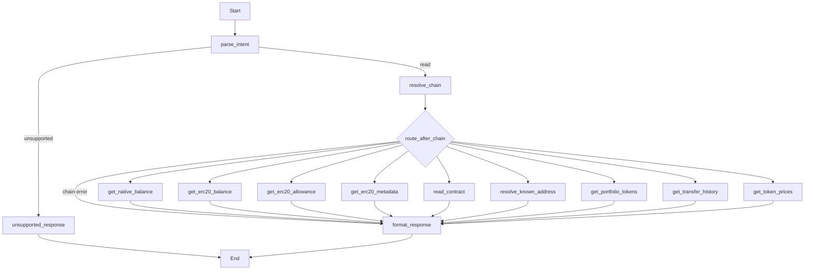

# Plan: Alchemy Prices API (Issue #13)

**Issue:** [agentic-pantheon/mercury-agentic-wallet#13](https://github.com/agentic-pantheon/mercury-agentic-wallet/issues/13)  
**Parent:** [Issue #8 – Add alchemy APIs](https://github.com/agentic-pantheon/mercury-agentic-wallet/issues/8)

## Summary

Add a read-only way to fetch **current token prices** (and optionally historical prices later) using Alchemy **Prices API**, as a dedicated graph node so agents can value ERC-20 positions by contract address on a specific network.

## Alchemy reference

- **Quickstart:** [Prices API quickstart](https://www.alchemy.com/docs/reference/prices-api-quickstart)
- **By address (primary for Mercury):** `POST https://api.g.alchemy.com/prices/v1/{apiKey}/tokens/by-address`
- **Request body:** `{ "addresses": [ { "network": "eth-mainnet", "address": "0x..." }, ... ] }`
- **Limits:** Up to **25** token address entries; up to **3** distinct networks per request (per current OpenAPI in docs).
- **Response:** `data[]` with `network`, `address`, `prices[]` (`currency`, `value`, `lastUpdatedAt`), per-item `error` when applicable.

**Note:** Portfolio **Tokens By Wallet** can already return `tokenPrices` when `withPrices: true`. This node is still valuable for explicit price-only queries, batching many tokens from transfer history, or when portfolio is not called.

## Codebase touchpoints

- [`mercury/graph/intents.py`](mercury/graph/intents.py): e.g. `token_prices` intent: list of `{token_address, chain}` or single pair; normalize to Alchemy `network` enums.
- [`mercury/graph/router.py`](mercury/graph/router.py): route mapping.
- [`mercury/graph/agent.py`](mercury/graph/agent.py): `get_token_prices` node.
- [`mercury/graph/nodes.py`](mercury/graph/nodes.py): tool input mapping.
- [`mercury/alchemy/prices.py`](mercury/alchemy/prices.py) (new) or extend shared Alchemy HTTP client from portfolio work.
- [`mercury/config.py`](mercury/config.py): reuse same Alchemy API key path as Portfolio unless Prices requires a separate key (usually same key).

## Implementation steps

1. Add `get_token_prices` LangChain tool posting to `/prices/v1/.../tokens/by-address` with `Authorization: Bearer` or path-style key per Alchemy docs examples; align with whatever pattern Portfolio uses for consistency.
2. Map Mercury chain names (`ethereum`, `base`, …) to Alchemy network strings via a single module shared with Portfolio and Transfers.
3. Validate batch size (≤25) and network count before HTTP; return a clear validation error if exceeded.
4. Wire intent, router, graph node, and response formatting (prices may be partial; surface per-token errors).
5. (Optional phase 2) `historical_prices` intent using [historical endpoint](https://www.alchemy.com/docs/data/prices-api/prices-api-endpoints/prices-api-endpoints/get-historical-token-prices) — keep out of MVP unless issue scope expands.

## Tests

- Route test for `token_prices`.
- Execution test with mocked HTTP response including one success and one `error` field in `data`.
- Validation test for >25 addresses.

## Acceptance criteria

- [ ] Structured intent returns USD (or requested currency if API supports multiple in one call) for each valid `(network, address)` pair.
- [ ] Partial failures do not crash the graph; failed tokens appear with error info in normalized output.
- [ ] Secrets: API key only via 1Claw path.

## LangGraph shape (read-only graph)

