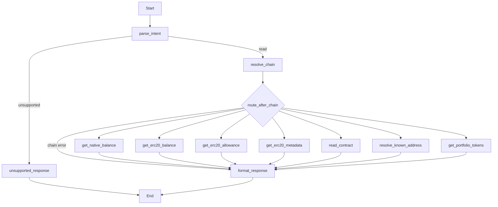

# Plan: Alchemy Portfolio API (Issue #14)

**Issue:** [agentic-pantheon/mercury-agentic-wallet#14](https://github.com/agentic-pantheon/mercury-agentic-wallet/issues/14)  
**Parent:** [Issue #8 – Add alchemy APIs](https://github.com/agentic-pantheon/mercury-agentic-wallet/issues/8)

## Summary

Expose “all tokens owned by a user” via Alchemy Portfolio **Tokens By Wallet**, wired as a new read-only LangGraph tool node so coordinators can request a portfolio snapshot without local indexing.

## Alchemy reference

- **Endpoint:** `POST https://api.g.alchemy.com/data/v1/{apiKey}/assets/tokens/by-address`
- **Docs:** [Get Tokens By Address](https://www.alchemy.com/docs/data/portfolio-apis/portfolio-api-endpoints/portfolio-api-endpoints/get-tokens-by-address)
- **Request flags:** `withMetadata`, `withPrices`, `includeNativeTokens`, `includeErc20Tokens`; body includes `addresses[]` with `address` and `networks[]` (Alchemy network enums, e.g. `eth-mainnet`, `base-mainnet`).
- **Limits:** Up to **2 addresses** and **5 networks per address** per call; paginate with `pageKey` when returned.

## Codebase touchpoints

- [`mercury/graph/intents.py`](mercury/graph/intents.py): new `ReadOnlyIntentKind`, e.g. `portfolio_tokens`, Pydantic model, aliases, `ParsedIntent` union.
- [`mercury/graph/nodes.py`](mercury/graph/nodes.py): extend `_tool_input_for_state` for the new kind.
- [`mercury/graph/router.py`](mercury/graph/router.py): `ROUTE_PORTFOLIO_TOKENS` and `_READ_ROUTES` entry.
- [`mercury/graph/agent.py`](mercury/graph/agent.py): `get_portfolio_tokens` node via `make_read_tool_node`, conditional edge from `resolve_chain`.
- [`mercury/tools/registry.py`](mercury/tools/registry.py): tool registration when using registry-backed reads.
- New: `mercury/alchemy/` client + DTO normalization (optional small module) and [`mercury/config.py`](mercury/config.py) secret path for API key (1Claw, like swap keys).
- [`mercury/tools/__init__.py`](mercury/tools/__init__.py): `create_readonly_tools` if the portfolio call is a LangChain tool.
- Tests: [`tests/test_graph_readonly_routes.py`](tests/test_graph_readonly_routes.py), [`tests/test_graph_readonly_execution.py`](tests/test_graph_readonly_execution.py); optional Alchemy client unit tests with mocked HTTP.
- Diagram: [`docs/graphs/mercury_read.mmd`](docs/graphs/mercury_read.mmd) after wiring.

## Implementation steps

1. Add `MercurySettings` field for Alchemy API key **path** (1Claw), not the raw key.
2. Implement an `AlchemyPortfolioClient` (or shared `AlchemyHttpClient`) that POSTs to `assets/tokens/by-address`, maps Mercury `chain_name` / [`mercury/chains`](mercury/chains/registry.py) to Alchemy `network` strings, and normalizes `data.tokens` into a stable `dict` for `tool_result`.
3. Add LangChain tool `get_portfolio_tokens` (or equivalent) that accepts `wallet_address`, optional explicit `networks[]` / `chain` expansion, and optional booleans mirroring Alchemy body flags; enforce address/network caps before the HTTP call.
4. Extend `parse_readonly_intent` for structured `kind: portfolio_tokens`; validate checksummed `wallet_address` (reuse `normalize_evm_address`).
5. Register the tool in `ReadOnlyToolRegistry.from_provider_factory` path (or inject Alchemy deps alongside `provider_factory` if HTTP does not use Web3).
6. Wire graph: `route_after_chain` → `get_portfolio_tokens` → `format_response`.
7. Update invoke / agent guide snippets if new intent must be documented for coordinators.

## Tests

- Route test: intent `portfolio_tokens` reaches `get_portfolio_tokens` and ends at `format_response`.
- Execution test: fake registry or mocked HTTP returns a minimal tokens payload; assert normalized `read_result` / `tool_result` shape and no secret leakage in errors.
- Validation test: more than 2 addresses or 6 networks yields a clear `MercuryError` / unsupported reason before calling Alchemy.

## Acceptance criteria

- [ ] Structured invoke with `kind: portfolio_tokens` returns token list (and optional prices/metadata) for at least Ethereum and Base when configured.
- [ ] Alchemy API key is loaded only via secret store path; never logged or placed in graph state.
- [ ] Pagination: if `pageKey` is returned, response includes it so clients can request the next page (either pass-through or documented follow-up intent).
- [ ] Graph routing and fake-tool tests cover the new path.

## LangGraph shape (read-only graph)

After this work, the compiled read graph gains one more branch from `resolve_chain`:

