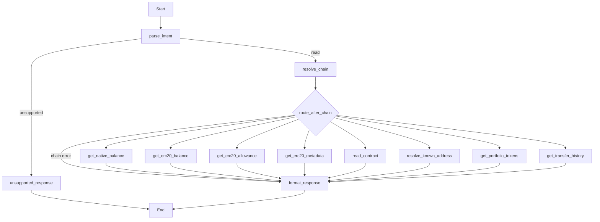
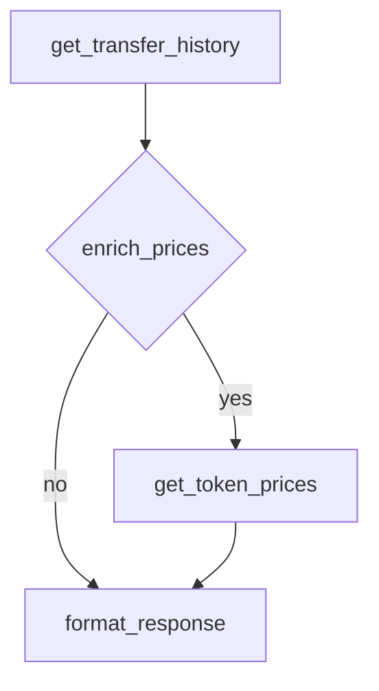

# Plan: Alchemy Transfers API (Issue #15)

**Issue:** [agentic-pantheon/mercury-agentic-wallet#15](https://github.com/agentic-pantheon/mercury-agentic-wallet/issues/15)  
**Parent:** [Issue #8 – Add alchemy APIs](https://github.com/agentic-pantheon/mercury-agentic-wallet/issues/8)

## Summary

Add historical transaction / transfer activity for a wallet using Alchemy’s **Transfers API** (`alchemy_getAssetTransfers`), exposed as a new read-only graph node for “portfolio transaction history” style queries.

## Alchemy reference

- **Overview:** [Transfers API quickstart](https://www.alchemy.com/docs/reference/transfers-api-quickstart)
- **RPC method:** `alchemy_getAssetTransfers` on the chain’s Alchemy JSON-RPC URL (same API key as node access) with params such as `fromAddress`, `toAddress`, `contractAddresses`, `category` (`external`, `erc20`, `erc721`, `erc1155`, `internal`, `specialnft`), `order`, `maxCount`, `pageKey`, `withMetadata`.
- **Pagination:** Use `pageKey` for next page; page keys expire (Alchemy documents ~10 minute TTL).
- **Timestamps:** Prefer `withMetadata: true` for human times, or document follow-up block timestamp lookup.

## Codebase touchpoints

- [`mercury/graph/intents.py`](mercury/graph/intents.py): e.g. `transfer_history` intent with `wallet_address`, optional `direction` (`in` | `out` | `both`), optional `categories`, block range, `max_count`, `page_key`.
- [`mercury/graph/router.py`](mercury/graph/router.py): new route constant and `_READ_ROUTES` mapping.
- [`mercury/graph/agent.py`](mercury/graph/agent.py): node `get_transfer_history` (or similar).
- [`mercury/graph/nodes.py`](mercury/graph/nodes.py): `_tool_input_for_state` branch for the new kind.
- Implementation detail: reuse [`mercury/providers/web3.py`](mercury/providers/web3.py) or a thin HTTP JSON-RPC helper that uses the **Alchemy** RPC URL from settings/secret store for the resolved chain (Transfers is not the REST Portfolio path).
- Optional composition: if `enrich_prices: true`, after transfers node completes, a second node or same tool batches distinct `(network, token_address)` into Prices API (see issue #13 plan); keep MVP as single node unless product requires USD per row.

## Implementation steps

1. Add typed builder for `alchemy_getAssetTransfers` params from Mercury chain + intent (map `fromAddress`/`toAddress` based on direction).
2. Implement read-only tool `get_transfer_history` invoking JSON-RPC POST to the chain’s Alchemy endpoint with API key from 1Claw.
3. Normalize each transfer into a stable record: `hash`, `block_num`, `from`, `to`, `category`, `asset`, `value`, `raw_contract`, metadata fields; include `page_key` at top level for clients.
4. Wire `parse_readonly_intent`, router, and `build_graph` node + edges.
5. Document pagination in coordinator guide: clients must echo `page_key` within TTL.

## Tests

- Route test for `transfer_history` intent.
- Execution test with mocked JSON-RPC response fixture (minimal transfers array + `pageKey`).
- Reject unsupported chains if no Alchemy RPC URL is configured for that chain.

## Acceptance criteria

- [ ] User can request history for a wallet on Ethereum and Base with structured intent and receive ordered transfers plus optional metadata.
- [ ] Pagination contract is explicit in `tool_result` (`page_key` pass-through).
- [ ] No private keys; RPC URL + API key from secrets only.

## LangGraph shape (read-only graph; single node MVP)

### Optional two-step subgraph (price enrichment flag)

If `enrich_prices` is implemented as a conditional second hop inside one graph invocation, extend to:

