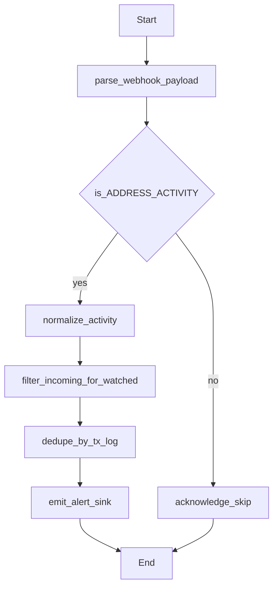
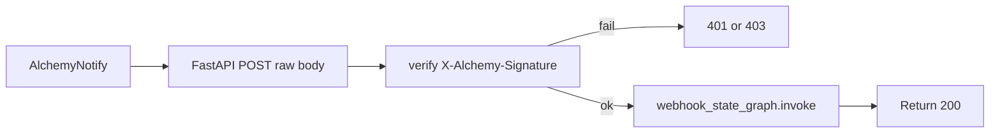

# Plan: Alchemy Webhooks / Notify (Issue #16)

**Issue:** [agentic-pantheon/mercury-agentic-wallet#16](https://github.com/agentic-pantheon/mercury-agentic-wallet/issues/16)  
**Parent:** [Issue #8 – Add alchemy APIs](https://github.com/agentic-pantheon/mercury-agentic-wallet/issues/8)

## Summary

Integrate Alchemy **Notify** webhooks so Mercury can **push** wallet activity (incoming transfers) to users or downstream systems. This is **event-driven** and should not be squeezed into the same request-response path as `/v1/mercury/invoke`.

## Alchemy reference

- **Quickstart:** [Webhooks quickstart](https://www.alchemy.com/docs/reference/notify-api-quickstart)
- **Wallet transfers (recommended for issue #16):** [Address Activity webhook](https://www.alchemy.com/docs/reference/address-activity-webhook) — EVM chains, tracks external ETH, token (ERC-20 / ERC-721 / ERC-1155), internal ETH where supported; up to **100,000** addresses per webhook.
- **Security:** Verify `X-Alchemy-Signature` with **HMAC SHA-256** over the **raw request body** using the webhook signing key from the dashboard; respond `200` after successful handling (Alchemy retries on non-200).
- **Management API:** create/update webhook, add/remove addresses ([Notify API methods](https://www.alchemy.com/docs/data/webhooks/webhooks-api-endpoints/notify-api-endpoints/create-webhook)).

## Codebase touchpoints

- [`mercury/service/api.py`](mercury/service/api.py): new route e.g. `POST /v1/webhooks/alchemy/address-activity` that receives **raw body** for signature verification (FastAPI: use `Request` and `await request.body()` or middleware pattern).
- New: `mercury/webhooks/alchemy_verify.py` — `is_valid_signature_for_string_body(body: bytes, signature: str, signing_key: str) -> bool` matching Alchemy examples (hex digest compare).
- New: `mercury/webhooks/alchemy_handler.py` — parse payload, filter `ADDRESS_ACTIVITY`, normalize `event.activity[]`.
- New: `mercury/graph/webhook_graph.py` or `build_alchemy_webhook_graph` in [`mercury/graph/agent.py`](mercury/graph/agent.py): small `StateGraph` with nodes: `verify_event` → `normalize_activity` → `filter_incoming` → `dedupe` → `emit_alert` → END (or single-node pipeline if simpler).
- [`mercury/config.py`](mercury/config.py): `alchemy_webhook_signing_key_secret_path` (1Claw) for signature verification; separate from JSON-RPC key if Alchemy issues distinct signing keys per webhook.
- [`mercury/service/dependencies.py`](mercury/service/dependencies.py): optional factory for webhook signing key resolution via `SecretStore`.

## Implementation steps

1. Add settings + secret path for the **webhook signing key** (not the generic Alchemy API key unless you confirm they are interchangeable — prefer dedicated signing key from webhook detail page per docs).
2. Implement FastAPI endpoint:
   - Read raw body bytes.
   - Read `X-Alchemy-Signature` header.
   - Load signing key from secret store; on mismatch return `401`/`403` without logging the key.
   - Parse JSON; handle `type: ADDRESS_ACTIVITY`.
3. Build webhook LangGraph (or plain handler callable) that:
   - Maps each activity to a stable alert DTO: `network`, `tx_hash`, `from`, `to`, `category`, `asset`, `value`, `contract_address`, `removed`.
   - **Incoming filter:** for tracked wallet `W`, keep rows where `toAddress` equals `W` (case-normalize addresses).
   - Dedupe by `(webhook_id, event_id, tx_hash, log_index)` or Alchemy-provided unique fields.
4. **Emit step:** pluggable sink — MVP: structured log + JSON response body `{"received": true, "processed": n}`; later: enqueue, push notification, or coordinator callback URL (out of scope unless specified).
5. Register webhook URL in Alchemy dashboard; document environment variables and path in [`mercury/service/MERCURY_AGENT_GUIDE.md`](mercury/service/MERCURY_AGENT_GUIDE.md) or README webhook section.
6. **Address roster:** either document manual dashboard setup, or add an internal admin API to call Alchemy “update webhook addresses” (optional; requires Auth Token from dashboard).

## Tests

- Unit test: signature verification accepts Alchemy sample payload + expected header; rejects tampered body.
- Handler test: fixture `ADDRESS_ACTIVITY` JSON produces N incoming alerts for a known watch address.
- FastAPI integration test: `TestClient` POST with invalid signature → 403; valid → 200.

## Acceptance criteria

- [ ] Exposed HTTPS endpoint verifies Alchemy signature per docs.
- [ ] Incoming ERC-20 / ETH / NFT activity to a watched address yields a normalized alert (at least logged).
- [ ] Duplicates across retries do not double-notify (in-memory dedupe MVP acceptable with TTL).
- [ ] Webhook path does not invoke the main `MercuryGraphRuntime.invoke` read/swap tx graphs unless you deliberately unify — keep isolation for latency and security.

## LangGraph shape (dedicated webhook graph)

This graph is invoked from the FastAPI webhook handler, not from user `invoke`:

### Service boundary (HTTP before graph)

